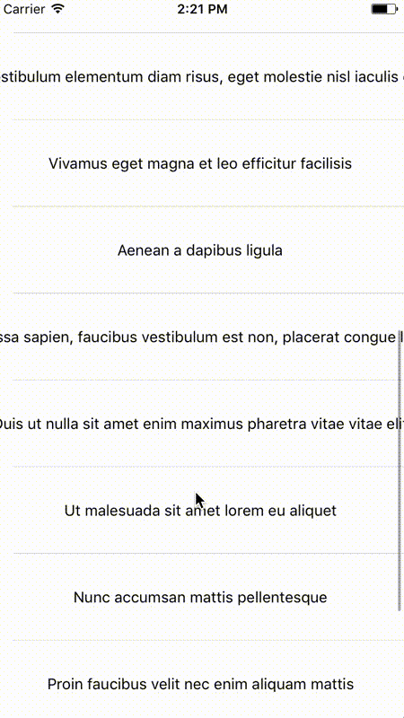
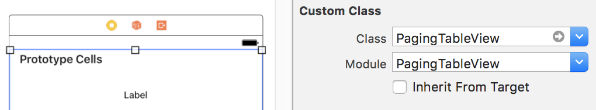

# PagingTableView

[](http://cocoapods.org/pods/PagingTableView)
[](https://github.com/mu29/PagingTableView/blob/master/LICENSE)
[](http://cocoapods.org/pods/PagingTableView)
[](https://developer.apple.com/swift/)

The simplest way to add paginate (a.k.a infinite scroll) function to your table view.  
All you have to do is just set your table view class in the storyboard to `PagingTableView`, and implement the `PagingTableViewDelegate#paginate`

## Installation

`PagingTableView` is available through [CocoaPods](http://cocoapods.org). To install
it, simply add the following line to your Podfile:

```ruby
pod "PagingTableView"
```

## Example



See full example [here](https://github.com/mu29/PagingTableView/blob/master/Example).  
To run the example project, clone the repo, and run `pod install` from the Example directory first.

## Usage

First set your table view class in the storyboard to `PagingTableView`



Then implement `paginate` function. If `isLoading` is set to true, an indicator is displayed at the bottom of the table view. Otherwise, the indicator disappears and `UITableView.reloadData` is called.

```swift
class MainViewController: UIViewController {

  override func viewDidLoad() {
    ...
    contentTable.pagingDelegate = self
  }

  ...

}

extension MainViewController: PagingTableViewDelegate {

  func paginate(_ tableView: PagingTableView, to page: Int) {
    contentTable.isLoading = true
    contentDataSource.loadData(at: page) { contents in
      self.contents.append(contentsOf: contents)
      self.contentTable.isLoading = false
    }
  }

}
```

See [example](https://github.com/mu29/PagingTableView/blob/master/Example) for more information.

## APIs

| Name | Type | Description |
|---|---|---|
| `pagingDelegate` | `PagingTableViewDelegate` | Delegate pagination processing |
| `currentPage` | `Int` | Returns the current page |
| `isLoading` | `Bool` | Shows and hides the loading indicator. Reload table view data after loading |
| `reset()` | `Void` | Return page to 0 and call `paginate` function |

## Author

InJung Chung / [@mu29](http://mu29.github.io/)

## License

`PagingTableView` is available under the MIT license. See the [LICENSE](https://github.com/mu29/PagingTableView/blob/master/LICENSE) file for more info.
